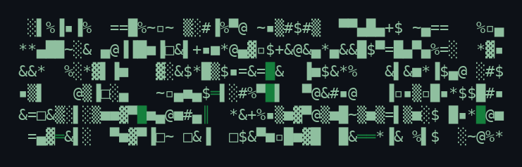

<!-- prettier-ignore -->
<div align="center">



### The Frontier Trading Agent

*Talk to it like a desk partner. It can't talk its way past your risk limits.*

[](https://www.npmjs.com/package/@general-liquidity/gordon-cli)
[](https://github.com/general-liquidity/gordon-cli/actions)
[](https://bun.sh)
[](https://www.typescriptlang.org)
[](./LICENSE)

**[Why Gordon](#why-gordon) · [Install](#install) · [Quick start](#quick-start) · [Safety](#how-gordon-keeps-you-safe) · [How it works](#how-it-works) · [Integrations](#integrations) · [Architecture](#architecture) · [Tech stack](#tech-stack)**

</div>

---

## Why Gordon

Since late 2022 we have watched AI get unnervingly good at *talking* about markets. A model will explain a setup, narrate a chart, and argue a thesis as fluently as a senior trader. Almost none of it is something you would actually hand your money to.

**In markets, AI does not have a capabilities problem. It has a trust problem.**

A model that can read a chart is not therefore able to size a position, respect a limit, recover from a failed order, or preserve capital through a drawdown. In most software, being slightly wrong is survivable. In markets, being *nearly* right is often just being wrong, with a settlement attached. The hard part was never the intelligence. It is the reasoning under uncertainty, the permissions, the approvals, the durable memory, the disciplined execution, and the clear failure modes that let a human safely delegate capital to software.

**Gordon is that missing harness.** It is a terminal-native trading agent for crypto and stocks that turns a plain-language intent, *"find me a clean BTC long for the NY session, ~1R"*, into a previewed, risk-checked, fully-audited trade. The model proposes. The harness disposes. Capital safety is not a feature bolted on at the end; it is the architecture.

```
you › find me a clean BTC long for the NY session, ~1R risk

gordon › BTC/USDT · $67,420 · 1H consolidation coiling on declining vol
         Setup: breakout-retest long above 67,650 VWAP reclaim
         Regime: risk-on, DXY soft, funding neutral
         Edge:  recent 20d hit rate 58%, avg 1.4R, expectancy +0.31R

         ┌─ Plan ──────────────────────────────────────────────┐
         │ + BUY   0.08 BTC @ 67,680  limit (post-only)        │
         │ + STOP  0.08 BTC @ 66,990  stop-market (-1.02%)     │
         │ + SELL  0.04 BTC @ 68,380  TP1 (+1.03%)             │
         │ + SELL  0.04 BTC @ 68,780  TP2 (+1.62%)             │
         └─────────────────────────────────────────────────────┘
         Risk: $27 on $10k · R:R 1:1.6 · allocation 5.4%
         Risk gate: PASS (15/15 dims) · constitution: clean

         [ approve ]  [ modify ]  [ reject ]  [ backtest ]
```

> [!WARNING]
> Gordon places real orders on real venues when armed. Trading is risky, you can lose money, and nothing in this repo is investment advice. Read the source, start in `paper` or `strict` mode, and never arm capital you can't afford to lose.

## Philosophy

Three convictions the whole codebase is built around.

**The model proposes, the harness disposes.** Intelligence and authority are separated by design. The agent that *reasons* about a trade is not the agent that *places* it, and neither can reach a venue without clearing a wall of deterministic checks. Capability is necessary. It is nowhere near sufficient.

**Plan-first, always.** Nothing touches a venue until you have seen it as a structured diff and approved it. Gordon's job is to make you a *better decision-maker, faster*, not to fire orders and explain itself afterward. Approvals are content-bound: change a single leg of a plan and it has to be approved again.

**Deny-first, not trust-first.** The default answer to "may this run?" is no. Every order earns its way to a venue through a permission engine, a 15-dimension risk classifier, a hard deny-list, and scoped kill switches. An agent cannot talk, charm, or hallucinate its way past a limit it is structurally forbidden to cross.

## Install

> [!NOTE]
> **Requirements:** Node.js ≥ 18 (for the npm wrapper) or [Bun](https://bun.sh) ≥ 1.0 (from source). A 64-bit, true-color terminal is strongly recommended.

```bash
npm install -g @general-liquidity/gordon-cli
```

The wrapper fetches the prebuilt binary for your platform (macOS arm64/x64, Linux x64/arm64 glibc + musl, Windows x64/arm64). The `gordon` command *is* the binary; no resident Node process.

<details>
<summary>Bun, or from source</summary>

```bash
bun add -g @general-liquidity/gordon-cli      # Bun global

git clone https://github.com/general-liquidity/gordon-cli.git
cd gordon-cli && bun install && bun run build && bun start   # from source
```
</details>

## Quick start

```bash
gordon
```

First run walks you through setup: an LLM provider, your venues, a default permission mode, and preferences. Everything lives under `~/.gordon/` and never leaves your machine. Set at least one model provider and one venue before placing real orders:

```bash
export ANTHROPIC_API_KEY="sk-ant-..."     # or OPENAI_API_KEY / GOOGLE_GENERATIVE_AI_API_KEY / DEDALUS_API_KEY
export BINANCE_API_KEY="..."  BINANCE_API_SECRET="..."     # a crypto venue
export ALPACA_API_KEY="..."   ALPACA_API_SECRET="..."      # or a stocks broker
```

Then talk to it, or drive it with slash commands:

```
/scan            what's moving right now
/analyze BTC     multi-timeframe workup on one symbol
/plan ETH        draft a trade plan (no orders placed)
/backtest        run a strategy over historical data
/portfolio       positions, cash, P/L across venues
/strict /paper /ask /auto    switch how far it may act on its own
/killswitch      freeze a venue, instrument, or strategy
/doctor          connectivity + config + permissions health check
```

> [!TIP]
> Start in `paper` or `strict`. Run `/doctor` any time to see which venues are wired, which credentials are missing, and what each is allowed to do.

## How Gordon keeps you safe

This is the part most trading bots don't have, and the reason Gordon exists. An order is defended in depth: it has to survive every layer before it reaches a venue.

| Layer | What it does |
|-------|--------------|
| **Permission engine** | Deny-first. Nothing runs without an explicit policy allow or a hook decision. Rejecting a parent trade cascade-denies its pending siblings. |
| **Risk classifier** | 15 dimensions (size, concentration, drawdown, loss budget, frequency, volatility, hours, familiarity + correlation, MEV, regime-transition, fake-liquidity, tail risk, …) → `auto_approve` / `prompt_user` / `require_confirmation` / `block`. |
| **Trust trajectory** | Consistently-approved tools can earn auto-approval, but a hard deny-list (`execute_plan`, `place_*_order`, `cancel_*`, `wallet_transfer`, `withdraw`, `exec_shell`, …) *always* bypasses trust. One rejection wipes accumulated trust. |
| **Kill switches** | A `firm → venue → instrument → strategy` scope hierarchy. Freeze one venue without touching the rest; state persists across restarts; resets need a logged rationale. |
| **Hooks** | 14 lifecycle points (`PreToolUse`, `PreOrderPlacement`, `PreApproval`, …) with parallel compliance calls and live TUI status. |
| **Audit + ledger** | Every gate decision is persisted with the full order, the risk decision, a portfolio snapshot, and the agent's reasoning trace. |

And `execute_plan` itself is a gauntlet. Before a single order fills, it clears (abridged):

> connection check → plan is `APPROVED` and unmutated → kill-switch gate → constitution halt → WIP limit → explain-before-execute → anti-rot gates (universe, thesis, mandate) → permission-mode check → price + trade validation → constitution violations → **15-dim risk classifier** → risk acknowledgement → `PreOrderPlacement` hooks → execute → post-trade reconciliation.

Rationale is structural, not advisory: `execute_plan` and every `cancel_*` demand a concrete, ≥10-character reason that is written to the audit trail, not just logged.

## How it works

Gordon is **three agents split along a security boundary**, not one model wearing many hats:

- **Gordon:** the orchestrator. Routes, supervises, and reasons, but never trades directly.
- **Executor:** holds the *only* execution tools, behind the full risk gate.
- **Researcher:** a read-only, time-boxed parallel clone for scans, backtests, and deep dives. It cannot place an order even if it tries to.

Around them sits the runtime that makes a long session trustworthy:

- **Cognition in phases:** a tool-free thinking pass, in-band extended thinking, and an optional adversarial self-critique at high depth.
- **A canonical 22-tool surface:** 5 data, 4 analytics (two of them meta-dispatchers over ~94 indicator and 9 microstructure ops), 6 plan/exec, 3 memory/audit, 4 workflow. Integration feeds (Finnhub, X, MCP, onchain) spread on top.
- **A doom-loop harness:** dual-layer fingerprinting catches both identical-call loops and A-B-A-B cycles; oversized tool results are offloaded to scratch.
- **5-stage memory compaction:** masking → pruning → aggressive → collapse → full, triggered by context pressure, with a reversible read-time collapse before any lossy summary.
- **A proactive radar:** 21 producers (regime flips, vol spikes, funding, whale alerts, news/earnings/insider flow, stop/TP alerts) scored by a tri-judge panel before they ever interrupt you.

## Integrations

Real adapters, not mock quotes. Gordon is model-, venue-, and editor-agnostic: it talks to the exchanges, brokers, data feeds, models, and editors you already use, and every market adapter passes an **inclusion gate** and a **conformance matrix** in CI, so broker quality is measured, not assumed.

#### Crypto exchanges

| Exchange | Markets | Connection |
|:--|:--|:--|
|  &nbsp;Binance | Spot | ccxt |
|  &nbsp;Hyperliquid | Perpetuals | ccxt · wallet |
|  &nbsp;Coinbase | Spot | ccxt |
|  &nbsp;Kraken | Spot | ccxt |
|  &nbsp;OKX | Spot | ccxt |
|  &nbsp;Gemini | Spot | ccxt |
|  &nbsp;Robinhood | Crypto | adapter |

<sub>Plus the wider [ccxt](https://ccxt.com) fleet (Bybit, KuCoin, MEXC, and more).</sub>

#### Equity &amp; options brokers

| Broker | Coverage |
|:--|:--|
|  &nbsp;Alpaca | US equities · options · crypto |
|  &nbsp;Charles Schwab | US equities · options · ETFs |
|  &nbsp;Interactive Brokers | Global equities · options · futures |
|  &nbsp;E\*TRADE | US equities · options |
|  &nbsp;tastytrade | Options · futures |
|  &nbsp;TradeStation | US equities · options · futures |
|  &nbsp;Tradier | US equities · options |
|  &nbsp;Trading 212 | UK/EU equities · ETFs |
|  &nbsp;Webull | US equities · options |

#### Onchain data &amp; intelligence

| Source | Provides |
|:--|:--|
|  &nbsp;Nansen | Wallet intelligence |
|  &nbsp;Arkham | Wallet intelligence |
|  &nbsp;Birdeye | Solana DEX data |
|  &nbsp;DeFiLlama | TVL · yields |
|  &nbsp;Glassnode | On-chain metrics |
|  &nbsp;DexScreener | DEX pairs |

#### Models &nbsp;<sub>provider-agnostic</sub>

| Provider | Models |
|:--|:--|
|  &nbsp;Anthropic | Claude |
|  &nbsp;OpenAI | GPT |
|  &nbsp;Google | Gemini |

<sub>Routed through Dedalus for single-key, multi-model access.</sub>

#### Editors &amp; hosts &nbsp;<sub>run Gordon from</sub>

| Editor / host | Connection |
|:--|:--|
|  &nbsp;Zed | Editor panel · ACP |
|  &nbsp;Athas | Editor panel · ACP |
|  &nbsp;Cursor | MCP |
|  &nbsp;Warp | MCP |
|  &nbsp;Claude Desktop | MCP |
|  &nbsp;Devin | MCP |

<sub>Also wired: Finnhub fundamentals, SEC/EDGAR filings, X sentiment, MoonPay on-ramp, and Polygon x402 rails.</sub>

## What's in the box

<details>
<summary><strong>Analysis & strategy</strong></summary>

- **~94 indicator ops** (RSI, MACD, Ichimoku, Supertrend, ATR, ADX, VWAP, plus exotics: SADF, frac-diff, Hurst, RSRS, Amihud) and **microstructure ops** (VPIN, footprint imbalance, order blocks, naked POC, displacement breaks, plus triangular-arbitrage-parity, a 3-leg no-arbitrage-breakdown dislocation signal).
- **Six-class regime classifier** from a 10-metric model, plus a **market-timing pair**, an O'Neil Follow-Through-Day confirmation and a Distribution-Day cluster counter, that generalizes from equity indices to crypto majors.
- **41-strategy library** (5 tier-1, 22 tier-2, a weighted ensemble, a condition DSL), plus markdown **playbooks** and **Edge-Driven Development** (`EDGE.md` specs that auto-retire when live metrics stop matching the backtest).
- **Cross-sectional risk:** a complex-wide deleveraging veto (one broad risk-off flush vetoes the whole oversold set, not N independent dips), an exposure-ceiling coach (regime + breadth → a deployable-capital cap), and an Avellaneda-Lee eigenportfolio-residual stat-arb signal.
- **Portfolio math:** Random-Matrix-Theory covariance denoising (Marchenko-Pastur), optimal-intensity Ledoit-Wolf shrinkage, HRP, Black-Litterman.
- **Options:** full Greeks (vanna / charm / vomma, dealer GEX) plus a held-position drawdown-cause classifier (delta- / theta- / IV-driven → a deterministic rebuy verdict).
- **Equity methodologies:** a CANSLIM 7-factor composite with bear-market gating, a parabolic-short exhaustion scorer, a PEAD gap-up grader, and an N-th-order scenario-impact analyzer.
</details>

<details>
<summary><strong>Planning, execution & market microstructure</strong></summary>

- **Contingency planning:** the model authors bull / base / bear / tail branches once, each with a pre-committed allocation and declared trigger levels; a deterministic resolver picks the live branch each cycle, with no LLM in the execution loop.
- **Settled-cash / GFV ledger:** buys clear only against settled cash with a T+1 pending bucket, so a Good-Faith-Violation is structurally impossible on a cash-account broker.
- **Resting-stop liveness watchdog:** flags any position whose protective stop has lapsed (day-order expiry, cancel, reject) and needs re-arming.
- **Order-book primitives:** a deterministic continuous-double-auction matching engine (price-time priority, partial fills, cancels) and a call-auction uncross for open / close equilibrium pricing.
</details>

<details>
<summary><strong>Autonomy & completion discipline</strong></summary>

- **Verified-completion gate:** an autonomous goal is never sealed on the agent's own say-so; an independent verifier has to fail to invalidate "done" first, closing the premature-completion failure mode.
- **Per-cycle gap-finding + just-in-time replanning:** each cycle re-derives the unmet-requirement set and regenerates the work list from the current state instead of trusting a fixed upfront plan; when it stops short it seals an honest *achieved-with-acknowledged-gaps* instead of a clean success.
- **Rotating self-audit:** a per-run deep pass over a rotating theme (script health, discovery coverage, dead weight, guardrail integrity, API budgets) that hunts the agent's own silent failures.
- **Bounded autonomous-loop driver** with mandate breach / expiry hard-stops, per-symbol caps, and goal-stall detection.
</details>

<details>
<summary><strong>Memory, governance & audit</strong></summary>

- **Thesis-lifecycle FSM:** every idea is a tracked object (IDEA → ENTRY_READY → ACTIVE → PARTIALLY_CLOSED → CLOSED) with scheduled review-due dates and an MAE / MFE postmortem, extending the trade journal rather than forking it.
- **Belief-tension counter:** a contradicting observation opens a for / against tally that flips or reconfirms a stored belief once the evidence crosses an adjustable bar.
- **Governance primitives:** named approval presets; a risk-state undo-lineage (a tightening auto-applies, a loosening into never-held territory is staged for approval and can never breach the compiled safety floor); an approval implementation-lifecycle ledger (approvals re-surface until actually applied); and temperament dials that tune decision thresholds within hard caps they can never loosen.
- **Boundary-durable audit:** handoff payloads are stored lossless (exempt from truncation) alongside an explicit parent-absorption record, both kept outside the signed content hash so the HMAC chain is unchanged.
- **5-stage compaction:** masking → pruning → aggressive → collapse → full, with a reversible read-time collapse before any lossy summary, and ACE lesson distillation across sessions.
</details>

<details>
<summary><strong>Backtesting, evaluation & learning</strong></summary>

- **Backtest engine:** historical replay, walk-forward, Monte Carlo, grid/random optimization, alpha-decay detection, fee-sensitivity sweeps, market-impact modeling, cross-sectional overfitting guards, and a scenario-realism validator, the full Cont stylized-facts battery (fat tails, vol clustering, Zumbach timescale asymmetry, gain/loss skew, aggregational Gaussianity).
- **Event-replay** with a `pass^k` verdict store for reliability across runs.
- **Eval harness:** scenarios *generated* from the trading constitution, risk dimensions, deny-list, and rubrics; deterministic process checks with per-scenario required/forbidden-action assertions (did the downsize happen, and did nothing unrelated break?); multi-turn scenarios that score a session spanning real clarification turns; a failure-mode taxonomy over failed runs; a tri-judge panel to wash out self-preference; and a CI regression gate.
- **Learning loop:** a regret ledger (rejected candidates reviewed at T+5 / T+20 to score whether the gate saved a loss or cost a gain), a setup model-book with forward-outcome cohort stats, counterfactual / inaction-value analysis, and a strategy-pivot stagnation detector.
</details>

## Permission modes

The same truth table is enforced in the preflight, the runtime engine, and every adapter. **Every mode still runs the risk classifier, kill switches, and audit.** The mode only sets how far the agent may act alone.

| Mode | Read | Plan | Paper | Live | |
|------|:----:|:----:|:-----:|:----:|--|
| `strict` | ✓ | ✗ | ✗ | ✗ | Read-only; nothing is written. |
| `observe` | ✓ | ✗ | ✗ | ✗ | Suggestions may fire; nothing executes. |
| `plan` | ✓ | ✓ | ✗ | ✗ | Plans created, never dispatched. |
| `paper` | ✓ | ✓ | ✓ | ✗ | Paper fills; real orders blocked. |
| `ask` | ✓ | ✓ | ✓ | ✓\* | **Default.** Every trade needs explicit approval. |
| `auto` | ✓ | ✓ | ✓ | ✓ | Autonomous within risk gates. For systematic slots. |

> [!IMPORTANT]
> `auto` is not "no guardrails." Every order still clears the full `execute_plan` gauntlet; it only drops the per-order human confirmation.

## Run surfaces

One engine, several front ends:

| Surface | Start with | What it is |
|---------|-----------|------------|
| TUI | `gordon` | The full Ink terminal desk (Desk / Market / Plan / Lab / Monitor workspaces, vim mode). |
| Headless | `gordon --headless "prompt"` | One prompt in, response out, for scripts and pipes. |
| Daemon | `gordon daemon start` | A long-running gateway over IPC: scheduled slots, circuit breakers, reconciliation. |
| ACP / IDE | `bun acp` | A JSON-RPC server over stdio implementing the [Agent Client Protocol](https://agentclientprotocol.com) for editors like Zed. |
| Schedules | `gordon schedule add …` | Cron-style autonomous mandates. |

## Architecture

```
surfaces      TUI · headless · daemon (IPC) · ACP/IDE · schedules
                                 │
orchestration   Gordon ─► Researcher (read-only)   ·   Executor (exec-only)
                cognition · memory · doom-loop harness
                                 │
governance      deny-first permission engine · 15-dim risk classifier
                trust trajectory + deny-list · kill switches · hooks · audit
                                 │
tools           canonical 22-tool surface + Finnhub / X / MCP / onchain
                                 │
venues & data   exchanges · brokers · onchain · wallet intel · news
                                 │
infrastructure  LibSQL (SQL + vector) · SQLite · OpenTelemetry · event bus
```

## Tech stack

| Technology | Role |
|:--|:--|
|  &nbsp;[Bun](https://bun.sh) | Runtime, bundler, test runner |
|  &nbsp;TypeScript | Language, strict mode |
|  &nbsp;Node.js | npm-wrapper runtime (>= 18) |
|  &nbsp;React 19 | TUI component model |
| Ink 6 | Terminal renderer + custom framebuffer |
|  &nbsp;[Mastra](https://mastra.ai) | Multi-agent framework |
|  &nbsp;AI SDK | Model calls (Anthropic, OpenAI, Google, Dedalus) |
|  &nbsp;[LibSQL / Turso](https://turso.tech/libsql) | SQL + vector memory; SQLite for the audit log |
|  &nbsp;[Zod](https://zod.dev) | Schema validation on every tool I/O and config |
|  &nbsp;[ccxt](https://ccxt.com) | Crypto exchange connectivity |
|  &nbsp;[MCP](https://modelcontextprotocol.io) | External tool servers |
|  &nbsp;[ACP](https://agentclientprotocol.com) | Editor / IDE integration |
|  &nbsp;Biome | Lint + format |
|  &nbsp;OpenTelemetry | Tracing + metrics |

## Development

```bash
bun install          # deps (postinstall patches Mastra + Ink)
bun run dev          # hot-reload TUI
bun test             # Bun's built-in runner (no Jest/Vitest), co-located *.test.ts
bun run typecheck    # tsc --noEmit
bun run build        # bundle to dist/  (--binary for a standalone executable)
bun run check        # Biome lint + format
bun run quality:brokers   # broker conformance + latency gate
```

CI runs the suite, `tsc --noEmit`, Biome, broker conformance, the eval-harness regression gate, and guardrails that block source-map leaks and stray files before publish.

---

<div align="center">
<sub><em>"The most valuable commodity I know of is information."</em><br />Gordon Gekko</sub>
</div>
